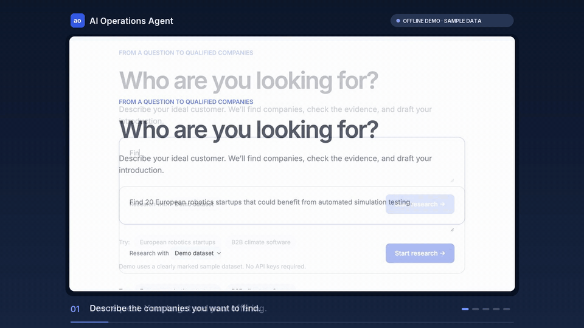
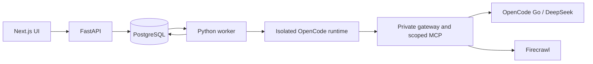

# AI Operations Agent

Turn one research request into a list of companies, verified website evidence, fit scores and introduction drafts. Review and edit the drafts, approve a saved revision, then export approved results as CSV or JSON.

A local, single-user MVP built with Next.js, FastAPI, PostgreSQL, Firecrawl and an isolated OpenCode research agent. English UI; research requests can be written in English or Russian. Nothing sends messages automatically.



## Quick start: no API keys

Requirements: Docker with Compose v2 and at least 5 GB of free disk space for the build. Run from the repository root:

```sh
cp .env.example .env
docker compose up --build -d --wait
```

Open [localhost:3100](http://localhost:3100), keep **Demo dataset** selected and try:

> Find 50 European robotics companies for simulation testing.

The demo uses explicitly synthetic companies and source evidence. **Live web** uses Firecrawl and OpenCode Go credentials after the runtime gate has been verified. See [setup and live configuration](docs/setup.md).

Open a company, inspect its evidence, edit the introduction and choose **Approve introduction**. **Export approved** downloads only approved saved revisions. Reloading the page restores the selected run; **Recent runs** opens older research.

Stop with `docker compose down`. The database volume retains research and approvals. `docker compose down -v` deletes that data.

## What it does

- Discovers company websites and removes duplicate domains within a campaign.
- Stores source text, content hashes and exact supporting quotations.
- Enriches companies and scores their fit; eligible results receive editable drafts.
- Saves successful work so cancellation, retries and restarts preserve completed results.
- Keeps human approvals separate from agent output and exports the approved revision.
- Shows per-run model requests, reported tokens, Firecrawl reservations and reported charges.

Defaults: 20 companies, maximum 50; qualification threshold 70; up to three pages per company domain; research batches of five; Firecrawl concurrency two. New installations enforce internal caps of 100 model requests and 250 reserved Firecrawl credits. The owner's existing local installation currently has caps disabled for measurement; this setting is in its ignored `.env`, not the shipped default.

## How it works



PostgreSQL owns product state, task leases and accounting. OpenCode owns research reasoning and proposes structured results. The backend validates evidence and saves results; the human owns approval. Provider credentials stay in the private gateway. Only the frontend is published, on `127.0.0.1:3100`.

OpenCode CLI is pinned to **1.18.35**, using **opencode-go/deepseek-v4.1-flash**. The supplied [operations-research skill](runtime-template/agent/.opencode/skills/operations-research/SKILL.md) is combined with deny-by-default tool permissions, task-scoped MCP and backend validation. A skill alone is not the authorization boundary. See [architecture](docs/architecture.md) and [why OpenCode](docs/decisions/0001-opencode-runtime.md).

## Verified behavior

Verification on 2026-10-08, runtime source at commit `659669c`:

| Check | Observed result | Status |
| --- | --- | --- |
| Backend | 62 tests against real PostgreSQL, including accounting, concurrent workers, stale leases and approval preservation | PASS |
| Browser | 12 desktop/mobile tests on the local production app, including existing live-result review; fresh offline runs skip the two live-dataset cases | PASS locally |
| Original live50 | 50 unique researched companies, 48 qualified, 64 source snapshots | PASS, native live |
| New Linux live5 | Five researched companies, nine source snapshots, 19 verified quotations | PASS, live |
| Typecheck, production build and restart | Linux containers rebuilt/recreated; usage and approved exports preserved | PASS |
| Remote GitHub Actions / public server deployment | Not executed | NOT RUN |

The measured live5 used **13 model requests / 189,439 reported tokens** and **25 Firecrawl credits**, confirmed by an account balance change from 724 to 699. This is one measured run, not a promised cost per five companies. Token counts do not establish a dollar invoice or how much a different provider would cost. See [current measurement](docs/verification/uncapped-acceptance.md) and [historical capped acceptance](docs/verification/acceptance.md).

## Documentation

| Guide | Contents |
| --- | --- |
| [Setup](docs/setup.md) | Docker/native installation, live gate, credentials, settings and troubleshooting |
| [Architecture](docs/architecture.md) | Pipeline, state ownership, tools, API and recovery |
| [OpenCode decision](docs/decisions/0001-opencode-runtime.md) | OpenCode vs a bounded model pipeline vs a custom agent |
| [Contributing](CONTRIBUTING.md) | Local checks and review expectations |
| [GitHub publication](docs/github.md) | Repository contents, publication steps and verification status |
| [Dependencies](docs/dependencies.md) | Resolved versions, licenses and verification |
| [Paper design](docs/design/README.md) | Approved desktop/mobile source and exported styles |
| [Product reference](docs/product.md) | Approved scope and subsequent owner decisions |

The MVP has no multi-user authentication, automatic outreach or public hosting. Internet-facing deployment is a separate phase. A project distribution license has not yet been selected.
