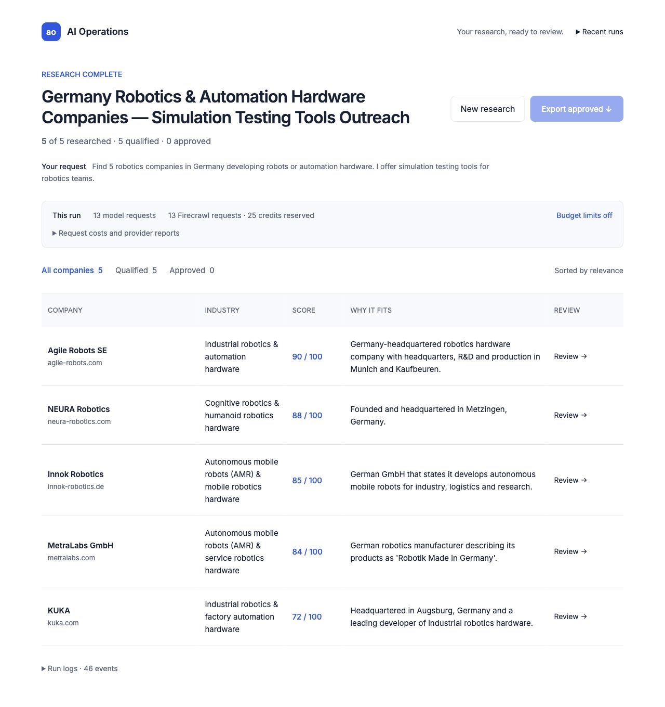

# Temporary uncapped usage measurement — 2026-10-08

The owner explicitly requested disabling the internal rate/budget limit to observe real request consumption. Before this change, the retained ledger was 87 model reservations and 250 Firecrawl reserved credits; the internal cap rejected Live starts although the Firecrawl account still had 724 credits. After the change, `BUDGET_LIMITS_ENABLED=false` permits Live dispatch while preserving the same ledger, capability boundaries and unknown reservations. Installation defaults still enforce the original caps. Historical acceptance remains in [the original report](acceptance.md).

| Criterion | Expected → observed | Status | Evidence |
| --- | --- | --- | --- |
| Consistent enforcement mode | API, both workers and private gateway disable only budget enforcement → effective false in every service, Live available, Go paid fallback confirmation retained | PASS | Container settings/readback; `uncapped-live.json` |
| Atomic usage and recovery | Over-cap reservations still counted; reenable caps without resetting; explicit retry preserves approval and fences prior capability; pilot-only stop resumes remaining work | PASS | 62 real PostgreSQL tests, 29.17s, including 21 new parameterized cases in `test_usage.py` |
| UI and affected workflows | Usage coverage/unknown charges displayed; Demo remains initial; evidence/edit/approve/reject/export/refresh/retry/older history work on desktop/mobile | PASS | 12 Playwright tests, 51.3s, production Linux app; automated tests created no paid research |
| Real Linux Live5 | Ordinary UI Live web → Start research → progress → five results and source/draft inspection | PASS (live) | Campaign `c0f7106e-dc6b-431a-b577-15bbb83a6131`; five researched/qualified, nine source snapshots, 19 checked quotes and all source hashes checked |
| Build and persistence | Typecheck/locked Linux builds, full six-container recreation → mode, accounting, sources and exact approved exports retained | PASS | See restart readback in `uncapped-live.json`; only localhost web published |
| Independent review | Read-only critique and combined code review of enforcement/accounting/retry/SSE/UI consumers → no material blocker | PASS | Separate gpt-6.1-sol review; reviewer did not independently run tests or external calls |
| Fresh full50 repeat / remote CI / server | Additional paid50, publication or deployment | NOT RUN | Existing completed native50 evidence preserved; this change verifies one real Linux Live5. No push or deployment requested. |

The real Live5 used **13 DeepSeek HTTP requests**, reporting **189,439 tokens** (171,632 input and 17,807 output), with complete token metadata coverage. Firecrawl received **13 requests**: four searches reserved/reported 16 credits, and nine scrapes reserved nine credits without per-response charge metadata. The separate Firecrawl account readback changed **724 → 699**, a 25-credit decrease matching this run's reservation total. No other live jobs ran during this measurement. Each request's report, estimate and status are visible under **Request costs and provider reports**. Go rolling/weekly/monthly account readings remained rounded 0%/1%/25%; this cannot establish a zero charge or a dollar price. No paid fallback or top-up was enabled.

The retained shared ledger is now **100 model reservations / 275 Firecrawl reserved credits**. The one historical uncertain model reservation remains; all new run requests received responses. Original MiR/FANUC revision2 CSV/JSON exports remain byte-identical to the pre-change baseline. Existing budget-stopped campaigns were not automatically restarted, and the new five drafts remain pending human review.

State/consumer review: PostgreSQL remains the owner of atomic accounting, immutable sources, draft revisions and approvals. Request statistics join only a campaign's jobs; optional validated provider metadata stays separate from reservation estimates. API admission, reservation enforcement, runtime error classification and pilot projection share the flag. Retry changes only unfinished work under the campaign lock; SSE observation preserves forwarded bytes and fragmented/incomplete stream accounting. No schema or dependency change was needed. Rollback is `BUDGET_LIMITS_ENABLED=true` followed by service recreation against the retained totals; no data reset. README, product reference and project guidance record the owner's temporary override and restart commands.

